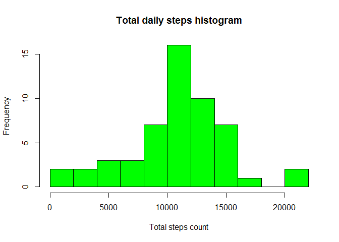
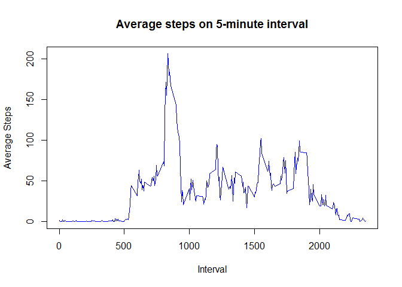
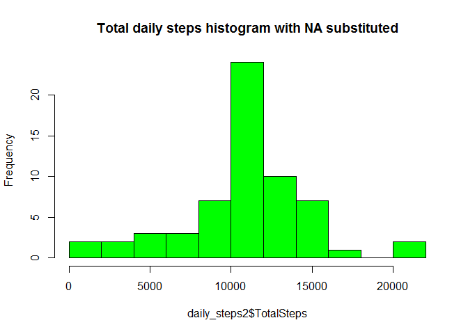
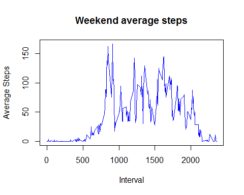
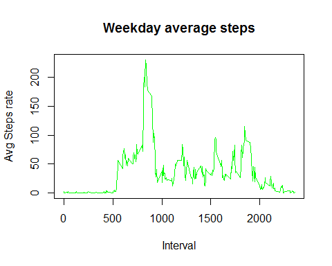

# Reproducible Research: Peer Assessment 1
Mohamed Abdelaziz  
Sunday, November 15, 2015  
---

This is an R Markdown document for first peer assessment of Reproducible Research course . 

## Loading and preprocessing the data


```r
dt <- read.csv( "activity.csv")
head(dt)
```

```
##   steps       date interval
## 1    NA 2012-10-01        0
## 2    NA 2012-10-01        5
## 3    NA 2012-10-01       10
## 4    NA 2012-10-01       15
## 5    NA 2012-10-01       20
## 6    NA 2012-10-01       25
```

## What is mean total number of steps taken per day?
While  ignoring the missing values in the dataset.


```r
acts <- dt[!is.na(dt$steps),]
acts$date <- factor(acts$date) 
daily_steps<- aggregate(acts$steps, list(acts$date),sum)
colnames(daily_steps) <- c("DayDate" , "TotalSteps")
```

1. Histogram of the total number of steps taken each day


```r
hist(daily_steps$TotalSteps , breaks= 10, 
     col = "green" , main="Total daily steps histogram" , xlab ="Total steps count") 
```

 

2. Mean and median of the total number of steps taken per day


```r
stepsDaymean <- mean(daily_steps$TotalSteps)
stepsDaymedian <-median( daily_steps$TotalSteps)
```
The mean of total daily steps count is 1.0766189\times 10^{4} steps/day  and median is 10765 steps/day  .


##What is the average daily activity pattern?

Caculating the average number of steps taken with in each 5-minute interval, averaged across all days.


```r
interval_steps<- aggregate(acts$steps, list(acts$interval),mean)
colnames(interval_steps) <- c("interval" , "AvgSteps")
```
Ploting average stepes taken for each time interval across all days.


```r
plot ( x=interval_steps$interval , y = interval_steps$AvgSteps 
       , type ='l' , col = 'blue' , main = "Average steps on 5-minute interval" 
       ,xlab = "Interval" , ylab ="Average Steps")
```

 

To determin Which 5-minute interval, on average across all the days in the dataset, contains the maximum number of steps. Getting maximum average steps count per interval.


```r
TopInterval <- interval_steps[ interval_steps$AvgSteps
                               ==max(interval_steps$AvgSteps),]
```

Interval 835 contains the maximum number of average steps which is 206.1698113 steps.

##Imputing missing values

```r
NaRowsCnt <- NROW(dt[is.na(dt$steps),])
NaRows    <- dt[is.na(dt$steps),]
```
1. Dataset contains 2304 missing values.

2. Using mean for a day to substitute the missing values at that day.


```r
NaRows<- merge( NaRows , interval_steps)
NaRows$steps <- NaRows$AvgSteps
```

3. Producing new dataset whith filling in all of the missing values in the dataset.

```r
NewActs<- rbind(acts , NaRows[,1:3])
NewActs <- NewActs[order(NewActs$date),] 
```


4. Histogram of the total number of steps taken each day and these mean and median.

```r
daily_steps2<- aggregate(NewActs$steps, list(NewActs$date),sum);
colnames(daily_steps2) <- c("DayDate" , "TotalSteps") ;
hist(daily_steps2$TotalSteps , breaks= 10, 
     col = "green" , main="Total daily steps histogram with NA substituted") ;
```

 

```r
stepsDaymean2 <- mean(daily_steps2$TotalSteps) ;
stepsDaymedian2 <-median( daily_steps2$TotalSteps);

comp<-data.frame(WithNA_Mean =stepsDaymean , NewMean = stepsDaymean2 , WithNA_Median= stepsDaymedian , NewMedian = stepsDaymedian2) 
```

  The mean of total daily steps count is 1.0766189\times 10^{4} steps/day  and median is     1.0766189\times 10^{4} steps/day  .
  
 Compare the expected mean and median considering missing values, with the calculated mean after filling missing data by each day average steps of the day of missing values . 

<!-- html table generated in R 3.2.2 by xtable 1.8-0 package -->
<!-- Mon Nov 30 11:28:47 2015 -->
<table border=1>
<tr> <th>  </th> <th> WithNA_Mean </th> <th> NewMean </th> <th> WithNA_Median </th> <th> NewMedian </th>  </tr>
  <tr> <td align="right"> 1 </td> <td align="right"> 10766.19 </td> <td align="right"> 10766.19 </td> <td align="right"> 10765 </td> <td align="right"> 10766.19 </td> </tr>
   </table>
  
  There is no change in mean and median of both datasets. 


## Are there differences in activity patterns between weekdays and weekends?


1.  Adding a factor variable "weekday" in the new dataset <with filled NA> with two levels – “weekday” and “weekend” indicating whether a given date is a weekday or weekend day.


```r
weekday<- function ( x )  
{ dd<- weekdays(as.Date (x)) ;
  if ( dd== "Sunday" | dd == "Saturday"  ) 
    ret = "weekend" 
  else ret = "weekday"    
  ret ;
}

NewActs$weekDay <- sapply (NewActs$date ,weekday)
NewActs$weekDay <- factor(NewActs$weekDay )
```

2. plotting 5-minute interval on (x-axis) and the average number of steps taken, averaged across all weekday days or weekend days (y-axis).


```r
weekday_Interval_steps<- aggregate(NewActs$steps, list(NewActs$weekDay , NewActs$interval ), mean)
colnames(weekday_Interval_steps)<- c("weekDay" , "interval" , "AvgSteps")
weekend_steps <- weekday_Interval_steps[weekday_Interval_steps$weekDay == "weekend",]
weekday_steps <- weekday_Interval_steps[weekday_Interval_steps$weekDay == "weekday",]

par ( mfrow = c( 1,1))
plot ( x= weekend_steps$interval , y = weekend_steps$AvgSteps 
       , type ='l' , col = 'blue' , main = "Weekend average steps"  
       ,xlab = "Interval" , ylab ="Average Steps")
```

 

```r
plot ( x= weekday_steps$interval , y = weekday_steps$AvgSteps  , type='l' , col = 'green',
         xlab= "Interval" , ylab= "Avg Steps rate" , main= "Weekday average steps")
```

 

From weekend and weekday average steps trend plots, we can notice that during weekends loads are distributed during the day intervals as usually (500 - 2000) > 50 steps/interval, 
But at weekday load is focused on narrower time slots and maximized between intervals( 500 - 1000) > 50 steps/interval.


################## ############################ ##################################
End Of assessment 1 
